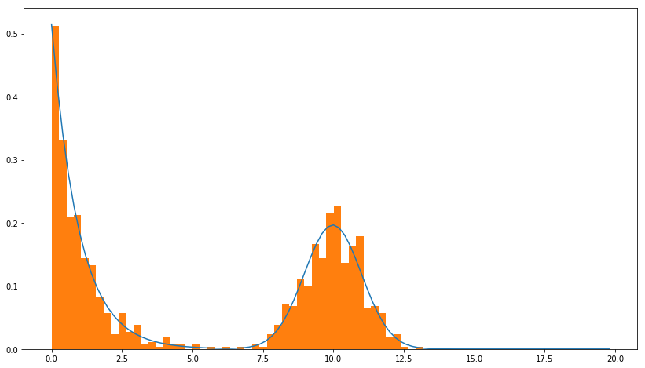

# Gaussian-Exponential Mixture

## Introduction

Like then name suggests, this package can be used to quickly fit a mixture of an
exponential distribution and a gaussian distribution to some data. This works with
numpy arrays, so you can easily add this to a Jupyter notebook style analysis.

## Motivation

This is a pattern that I have seen in data where there are boundaries to data
and a clear edge distribution forms on the practical lower bound of the global
distribution while a more symmetric population forms somewhere well clear of an edge.

An example of this is time users spend on a blog post or article. There is an edge
at zero (since we cannot view an article for a negative amount of time) and
often a non-trivial bounce rate in the first few seconds, then a
smoother distribution forms away from the edge that may be modeled well by a
normal distribution.

## Installing

This requires python 3.6 +

```shell script
git clone https://github.com/ethanwh/gaussian-exponential-mixture.git
cd gaussian-exponential-mixture
pip install .
```

## Usage
```python
import numpy
from gaussian_exponential_mixture import GaussianExponentialMixture

beta, mu, sigma = 1, 10, 1

exponential_data = numpy.random.exponential(scale=beta, size=500)
gaussian_data = numpy.random.normal(loc=mu, scale=sigma, size=500)
mixed_data = numpy.append(exponential_data, gaussian_data)
mix = GaussianExponentialMixture(mixed_data)
mix.fit()

print(mix.parameters)
```

```
beta: 1.02511 | mu: 9.97145 | sigma: 1.04869 | proportion: 0.50000
```

To see the results next to the data you can plot the fit distribution.

```python
from matplotlib import pyplot as plt
x = numpy.arange(20, step=0.2)
plt.plot(x, mix.pdf(x))
plt.hist(mixed_data, density=True, bins=50)
plt.show()
```

